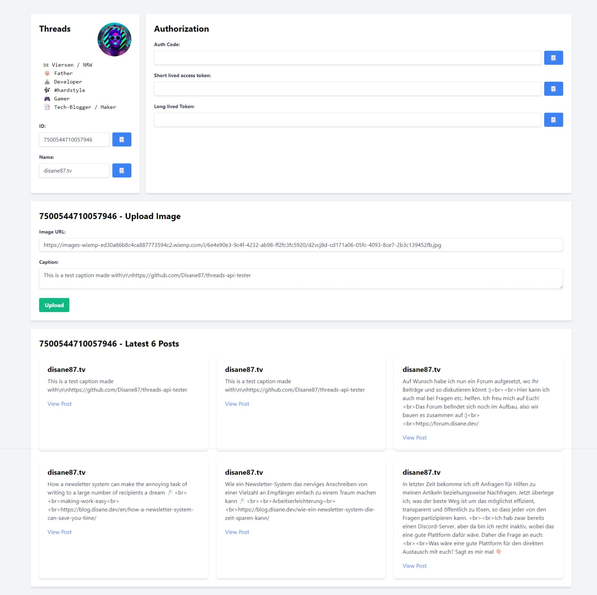

# Threads API tester 🎉

Python script to extract your threads api access tokens to automate stuff 🔥

## Installation

Just clone the repo and install deps

```bash
pip install -r requirements.txt
```

## Usage/Examples

Add to your host file:
```
127.0.0.1   threads-sample.meta
```

> [!WARNING]  
> This is needed because Threads API prevent callbacks to `localhost`

Create an `.env` file with the content of `.env.example` and your Threads `CLIENT_ID` and `CLIENT_SECRET`. If you don't know how to get these values, head over to my blog:

[Threads API is here ☝️](https://blog.disane.dev/en/threads-api-is-here/)

Please add `https://threads-sample.meta:5000/callback` to your Threads OAuth callback url to get the sample working. If you encounter an insecure SSL warning of your browser, it's just normal, because this script generates a self signed certificate for you.

After that just simply execute the script:
```bash
python ./main.py
```

Or if you use Visual Studio Code, hit `F5`.

> [!IMPORTANT]  
> Never share these access tokens with anyone! This script runs only on your end and your tokens will never leave your system, only when you do!


## The result
After a getting the auth code to the callback endpoint you should see this page:


You also have the ability to post a test post to ensure everything is working.

